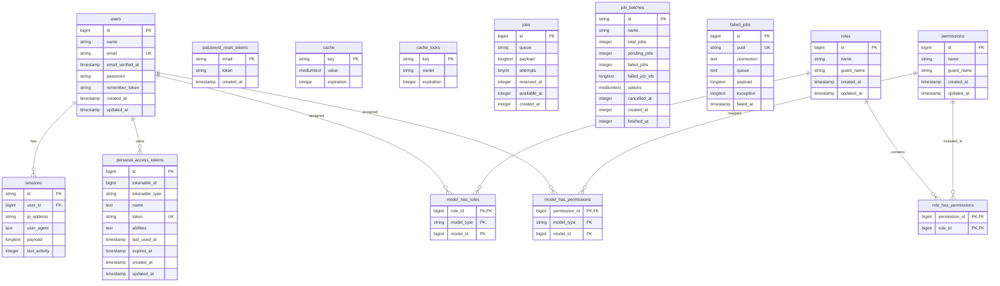

# ERD

```mermaid
erDiagram
    users {
        bigint id PK
        string name
        string email UK
        timestamp email_verified_at
        string password
        string remember_token
        timestamp created_at
        timestamp updated_at
    }

    password_reset_tokens {
        string email PK
        string token
        timestamp created_at
    }

    sessions {
        string id PK
        bigint user_id FK
        string ip_address
        text user_agent
        longtext payload
        integer last_activity
    }

    cache {
        string key PK
        mediumtext value
        integer expiration
    }

    cache_locks {
        string key PK
        string owner
        integer expiration
    }

    jobs {
        bigint id PK
        string queue
        longtext payload
        tinyint attempts
        integer reserved_at
        integer available_at
        integer created_at
    }

    job_batches {
        string id PK
        string name
        integer total_jobs
        integer pending_jobs
        integer failed_jobs
        longtext failed_job_ids
        mediumtext options
        integer cancelled_at
        integer created_at
        integer finished_at
    }

    failed_jobs {
        bigint id PK
        string uuid UK
        text connection
        text queue
        longtext payload
        longtext exception
        timestamp failed_at
    }

    personal_access_tokens {
        bigint id PK
        bigint tokenable_id
        string tokenable_type
        text name
        string token UK
        text abilities
        timestamp last_used_at
        timestamp expires_at
        timestamp created_at
        timestamp updated_at
    }

    roles {
        bigint id PK
        string name
        string guard_name
        timestamp created_at
        timestamp updated_at
    }

    permissions {
        bigint id PK
        string name
        string guard_name
        timestamp created_at
        timestamp updated_at
    }

    model_has_roles {
        bigint role_id PK, FK
        string model_type PK
        bigint model_id PK
    }

    model_has_permissions {
        bigint permission_id PK, FK
        string model_type PK
        bigint model_id PK
    }

    role_has_permissions {
        bigint permission_id PK, FK
        bigint role_id PK, FK
    }

    users ||--o{ sessions : "has"
    users ||--o{ personal_access_tokens : "owns"
    users ||--o{ model_has_roles : "assigned"
    users ||--o{ model_has_permissions : "assigned"
    roles ||--o{ model_has_roles : "mapped"
    permissions ||--o{ model_has_permissions : "mapped"
    roles ||--o{ role_has_permissions : "contains"
    permissions ||--o{ role_has_permissions : "included_in"
```
